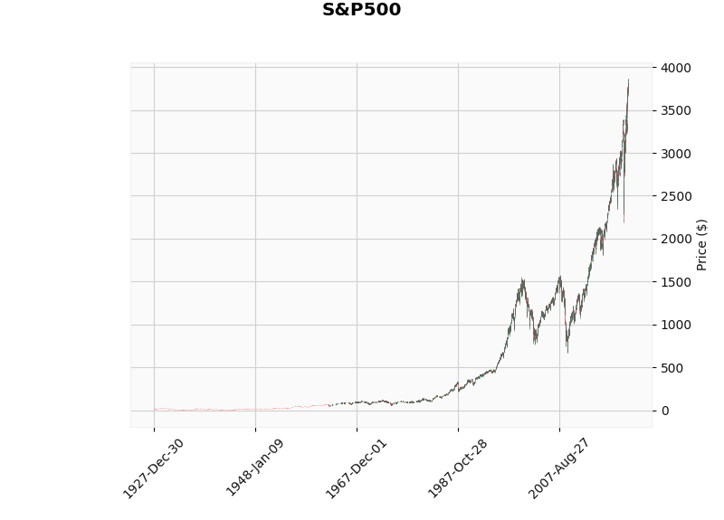
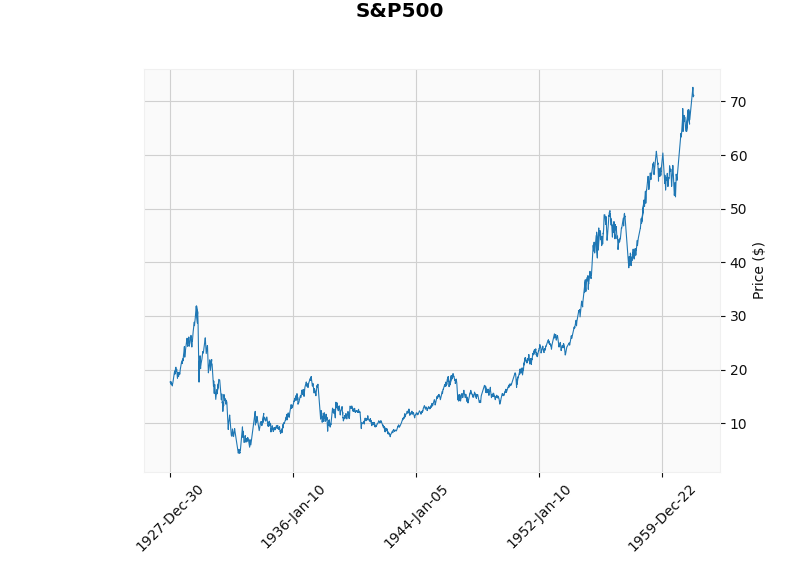
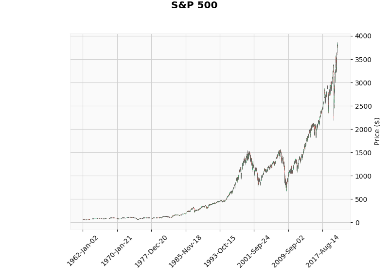

# Convolutional Networks for Stock Trading

We will try to use convolutional networks to predict movements in stock prices
from a picture of a time series of past price fluctuations, with the ultimate 
goal of using them to buy and sell shares of stock in order to make a profit.

## Useful resources 

* [Convolutional Networks for Stock Trading, Stanford](http://cs231n.stanford.edu/reports/2015/pdfs/ashwin_final_paper.pdf)
* [A quantitative trading method using deep convolution neural network](https://iopscience.iop.org/article/10.1088/1757-899X/490/4/042018/pdf)
* [Predicting the Trend of Stock Market Index Using the Hybrid Neural Network Based on Multiple Time Scale Feature Learning](data/applsci-10-03961.pdf)
* [Algorithmic Financial Trading with Deep Convolutional Neural Networks: Time Series to Image Conversion Approach](https://www.researchgate.net/publication/324802031_Algorithmic_Financial_Trading_with_Deep_Convolutional_Neural_Networks_Time_Series_to_Image_Conversion_Approach)
* [Stock Market Buy/Sell/Hold prediction Using convolutional Neural Network](https://github.com/nayash/stock_cnn_blog_pub)
* [Kaggle: Predicting Stock Buy/Sell signal using CNN](https://www.kaggle.com/darkknight91/predicting-stock-buy-sell-signal-using-cnn/#data)
* [yahoo finance](https://finance.yahoo.com/quote/BTCUSD%3DX/history?p=BTCUSD%3DX)

# Intro

We want to build a DNN that can predict the following trend by candle plot.

Every candle represents a certain time interval 1 day, 1 hour or 1 minute. Now 
let me briefly explain to you what does mean every bar that usually 
called a "candle".

Weeeell, we have red and blue or usually green candles on the picture. And upper
and lower tails shows us the highest and lowest prices respectively. Whereas, 
upper and downer sides of the bar show us opening price and closing not respectively.
If the bar is blue or green it means the opening price is lower than closing. 
If the bar is red vice versa.

# Our main goal

To have fun and finally to fill gaps from the last term in Deep Learning 
(LSTM, autoencoders). Also, to build a NN that allows to predict to following 
trend by the history right before it.

What's sequence of candle we should expect after 2PM?

# Tasks to reach our goal

0. Read "Useful resources" (Everybody/ Partially done)
1. Collect Data: (Everybody) (yahoo.finance)
2. Train A CNN to extract data from a picture of a candle.
    1. Draw Candle plots for a fixed range (maybe a month) and save them as jpeg/png.
    2. Slice those candle plots into a single candle plot.
    3. Create labels out of those candle pictures.
3. Apply Classic Approaches for Time series data:
    1. The autoregressive model AR(p).
    2. The moving average MA(q) Model.
    3. The ARMA(p,q) Model.
    4. Maybe show partial autocorrelation function.
4. Apply a NN:
    1. Apply a time delay neural networks TDNN.
    2. Apply a simple recurrent neural network RNN.
    3. Apply a LSTM.
5. Compare result.
    

# Initial Analysis 

Candles for the whole period.

There is something odd between 1948 and 1967.

Red dots are barely seen. Let's look at those as on a line.

Looks okay, but perhaps there was something wrong with data originally. So we 
will ignore these data until `1962-01-03`. So we have the next data for every
day (14 867 observations). 

